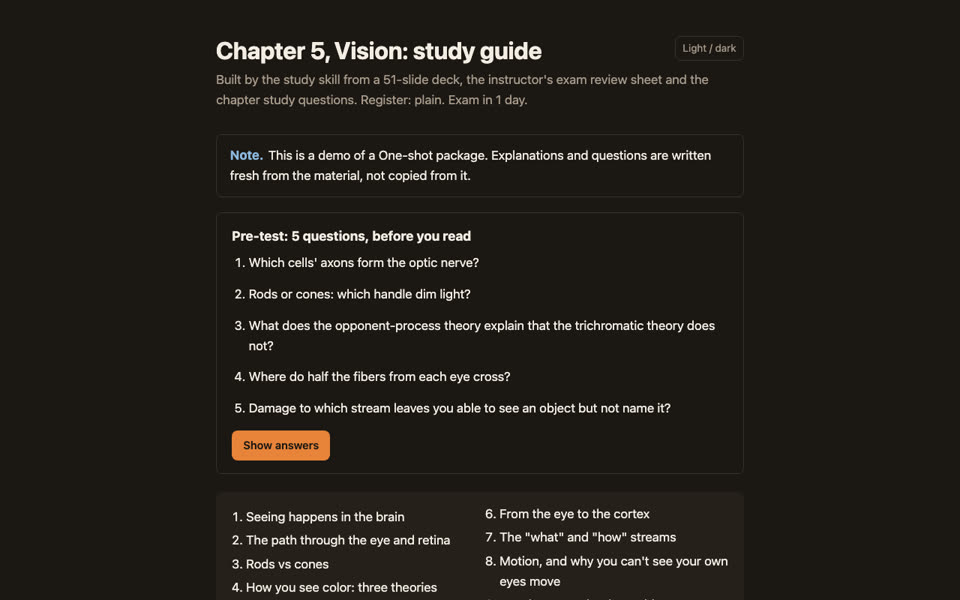
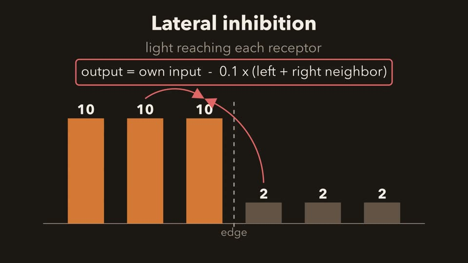

<h1 align="center">study</h1>
<p align="center">
  <strong>An AI study partner that learns how <em>your</em> instructor tests, then drills you or builds you a complete study package.</strong>
</p>
<p align="center">
  <a href="https://sa1emie.github.io/study-skill/">Live demo</a> ·
  <a href="#install">Install</a> ·
  <a href="#how-to-use-it">How to use it</a> ·
  <a href="LICENSE"></a>
</p>

<p align="center">
  <a href="https://sa1emie.github.io/study-skill/vision/guide.html"></a>
  <a href="https://sa1emie.github.io/study-skill/vision/lateral-inhibition.html"></a>
</p>

Give it your slides, review sheets, lecture transcripts and past exams. It
reads them once, works out what your instructor actually emphasizes and how
they ask questions, and then does one of two things:

- **Companion**: quizzes you, never gives the answer before you try, explains
  what you missed, and schedules reviews across days.
- **One-shot**: builds a finished study package you use on your own: a study
  guide with pre and post tests, diagrams, narrated explainer videos,
  "predict, then drag" simulations, practice questions and flashcards.

It is an [Agent Skill](https://docs.claude.com/en/docs/claude-code/skills) for
Claude Code, and also works in Codex, Cursor, other coding agents, and plain
chat apps.

**See it working on one real chapter:** [sa1emie.github.io/study-skill](https://sa1emie.github.io/study-skill/)

## Install

### Claude Code (recommended)

```bash
git clone https://github.com/sa1emie/study-skill.git
mkdir -p ~/.claude/skills
cp -r study-skill/study ~/.claude/skills/
```

That's it. Start Claude Code anywhere and say what you need, or type `/study`.

**Optional: explainer videos.** Videos are made locally and for free (Manim
for animation, Kokoro for the voice, no API key). One-time setup, about 1.2 GB:

```bash
bash ~/.claude/skills/study/scripts/explainer/setup.sh
```

Needs Python 3.10+, ffmpeg, and Homebrew on macOS (or the apt packages the
script prints on Linux). Everything else works without it.

### Codex, OpenCode, and other AGENTS.md tools

Run inside the folder you study in:

```bash
git clone https://github.com/sa1emie/study-skill.git /tmp/study-skill
cp /tmp/study-skill/study.md .
cat /tmp/study-skill/adapters/agents-md/study-section.md >> AGENTS.md
```

### Cursor

Run inside each project you want it in:

```bash
git clone https://github.com/sa1emie/study-skill.git /tmp/study-skill
cp /tmp/study-skill/study.md .
mkdir -p .cursor/rules && cp /tmp/study-skill/adapters/cursor/study.mdc .cursor/rules/
```

### Plain chat (ChatGPT, Claude.ai, Gemini)

Download [`study.md`](study.md), upload it, and send:

> Read study.md in full and follow it for this conversation, including
> "Degraded mode", since you have no file system. Here's my course material.

Use One-shot mode there; progress tracking needs files. More in
[`basic-chat/README.md`](basic-chat/README.md).

## How to use it

**1. Make a folder per class or exam and put your material in `raw/`.**

```
~/study/
  bio-exam-2/
    raw/
      chapter-5-slides.pptx
      exam-review-sheet.docx
      lecture-12-transcript.txt
```

Anything works: slides, PDFs, notes, transcripts, past exams, a syllabus. The
more it has that shows how you will be tested (review sheets, old exams), the
better its sense of what matters.

**2. Open your agent in that folder and say what you want, in normal words.**

| You say | It does |
|---|---|
| "here's chapter 5, exam is tomorrow at 9" | Reads everything, tells you what it found, asks Companion or One-shot |
| "quiz me" | Short pre-test, then drills your weakest high-yield topics |
| "just make me a study guide" | Builds the package, sized to the time you have |
| "too complicated" / "explain it simply" | Switches to plain words, one analogy, and the exam cue |
| "make a diagram of the visual pathway" | Draws it, renders it, checks it, adds it to the guide |
| "make a video on lateral inhibition" | A narrated 60-120 s explainer that ends in questions |
| "how am I doing?" | Shows weak topics, pre/post test gains, and what is due |

**3. Come back.** Everything is saved in the folder: what you missed, when to
review it next, what was built. Say "quiz me" next time and it picks up where
you left off.

Things it will not do: give you the answer before you try, invent what your
instructor said without a quote, or present guesses as evidence. Everything it
adds beyond your material is labeled.

## What's in this repo

```
study/                 the skill (copy this folder to ~/.claude/skills/)
  SKILL.md             the instructions
  references/          detailed rules, loaded only when needed
  scripts/             scheduler, Anki export, video pipeline, page inliner
  assets/              the HTML design system: study.css, study.js, template.html
study.md               the whole skill in one file, for other tools (generated)
adapters/              Cursor rule and AGENTS.md snippet
docs/                  the demo site
examples/              a fabricated example unit and the demo video's source
tools/build_portable.py  rebuilds study.md from study/
```

## Configuration

Optional. Create `~/study/config.md` to set a default mode, register, tone,
answer length, grading strictness, or whether you use Anki, so it stops
asking. Keys are listed in [INSTALL.md](INSTALL.md#configuration).

## How it works

1. **Ingest** reads your material once and classifies each source. A review
   session says far more about the exam than a slide deck.
2. **Instructor model** records what they emphasize, exclude, and reuse. Every
   claim is tagged `OBSERVED` (has a quote), `INFERRED` (a pattern), or
   `SPECULATIVE` (never planned around).
3. **Concept graph** maps prerequisites and weights each topic by evidence.
4. Then **Companion** picks a drilling method per topic and schedules reviews
   (getting an advanced topic right gives partial credit to its
   prerequisites), or **One-shot** builds the package. Both measure with a
   pre-test and a post-test.

Full detail in [`study/SKILL.md`](study/SKILL.md).

## Privacy and honesty

An instructor model built from real lectures is a file of quotes attributed to
a real person. Keep your study folders private, and check your school's policy
before recording lectures. The example in `examples/` is entirely fabricated.

This is a tool for learning the material. It drills and explains; it is not
built to complete graded work for you.

## Credits

Built by [sa1emie](https://github.com/sa1emie) with
[Claude Code](https://claude.com/claude-code). The "simple words, then diagrams,
then bespoke explainer videos" direction follows Andrej Karpathy's notes on
understanding LLM output. Issues and pull requests welcome, especially examples
of material the skill handles badly.

MIT License.
